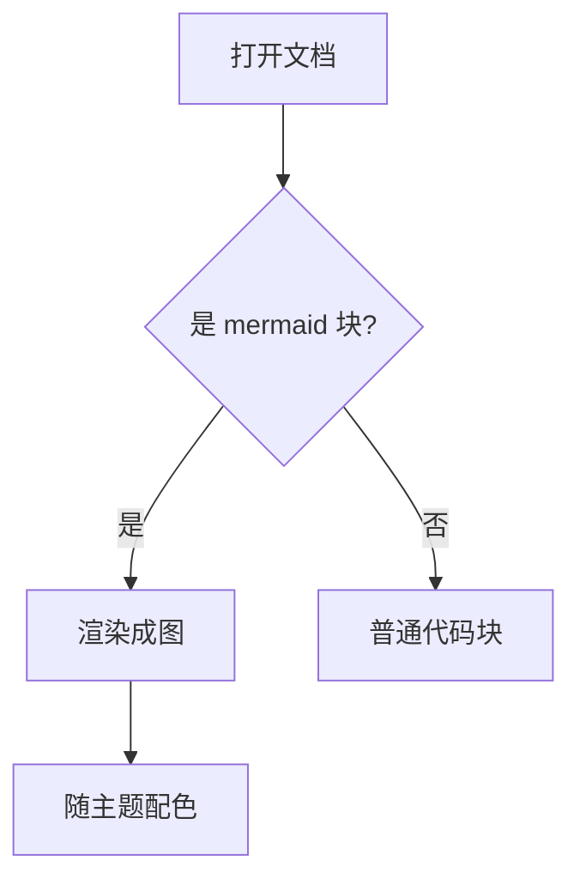

# mermaid 图表

正常用例（应渲染成 SVG）：

```mermaid
flowchart TD
    A[打开文档] --> B{是 mermaid 块?}
    B -->|是| C[渲染成图]
    B -->|否| D[普通代码块]
    C --> E[随主题配色]
```

非法用例（应保留源码并显示错误，而不是白屏）：

```mermaid
flowchart TD
    A -->
```
